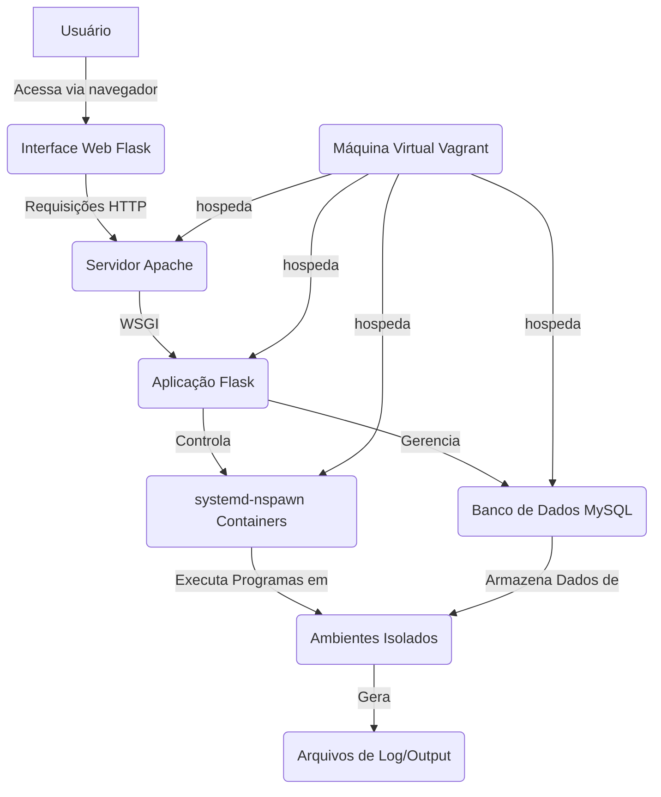

# Gerenciador de Ambientes de Execução Web

Este projeto visa implementar um sistema web para gerenciar e executar programas em ambientes isolados, utilizando tecnologias de virtualização e conteinerização. A solução permite que usuários criem, configurem e monitorem ambientes de execução personalizados diretamente de uma interface web, com controle granular sobre recursos como CPU, memória e I/O.

## Funcionalidades Principais

O sistema oferece as seguintes funcionalidades:

*   **Criação de Ambientes Isolados**: Permite a criação de novos ambientes de execução utilizando namespaces, garantindo isolamento entre as tarefas.
*   **Alocação de Recursos**: O usuário pode definir a quantidade de CPU, memória e I/O a ser alocada para cada ambiente, otimizando o uso dos recursos do servidor.
*   **Execução Flexível**: Suporta a execução de programas, múltiplos programas ou scripts desenvolvidos pelo usuário dentro dos ambientes criados.
*   **Monitoramento de Output**: O output da execução dos programas é direcionado para arquivos específicos, que podem ser visualizados a qualquer momento através da interface web.
*   **Suporte a Serviços de Longa Duração**: Projetado para lidar com programas que não terminam sua execução imediatamente, como serviços ou aplicações persistentes.
*   **Listagem e Status de Ambientes**: Oferece uma visão geral de todos os ambientes criados, exibindo seus status (em execução, terminado, erro).
*   **Gerenciamento de Ambientes**: Funcionalidades para remover ou terminar a execução de programas e ambientes.

## Arquitetura do Projeto

A arquitetura do projeto é baseada em uma máquina virtual provisionada via Vagrant, que hospeda um servidor web Apache, uma aplicação Flask e um banco de dados MySQL. A conteinerização é realizada utilizando `systemd-nspawn` para criar os ambientes isolados.

### Componentes Chave:

*   **Vagrant e VirtualBox**: Utilizados para provisionar e gerenciar a máquina virtual (VM) que serve como base para o ambiente de execução. A VM é configurada com Ubuntu Jammy64, 2 CPUs e 4096MB de memória RAM.
*   **Apache**: Servidor web responsável por servir a interface da aplicação Flask.
*   **Flask**: Framework web Python utilizado para desenvolver a interface do usuário e a lógica de backend para gerenciar os ambientes de execução.
*   **MySQL**: Banco de dados relacional para armazenamento persistente de dados, incluindo informações sobre os ambientes criados, suas configurações e status.
*   **`systemd-nspawn`**: Ferramenta de conteinerização leve do `systemd` utilizada para criar os ambientes isolados (namespaces) onde os programas dos usuários serão executados.
*   **Sincronização de Pastas**: A pasta do projeto local é sincronizada com a VM (`/vagrant`), facilitando o desenvolvimento e a implantação do código.

### Diagrama de Arquitetura (Conceitual):



## Estrutura de Pastas

```
. 
├── .vagrant/                 # Arquivos internos do Vagrant
├── vagrant_envs/             # Diretório para ambientes Vagrant (se houver)
├── webapp/                   # Aplicação Flask e arquivos relacionados
│   ├── __pycache__/          # Cache do Python
│   ├── .venv/                # Ambiente virtual Python (local)
│   ├── logs/                 # Logs da aplicação
│   ├── templates/            # Templates HTML do Flask
│   │   └── index.html
│   ├── app.py                # Lógica principal da aplicação Flask
│   ├── db.py                 # Módulo de interação com o banco de dados
│   ├── flaskapp.wsgi         # Arquivo WSGI para o Apache
│   ├── manage_env.py         # Script para gerenciar ambientes (criação, remoção, etc.)
│   ├── requirements.txt      # Dependências Python do projeto
│   ├── test_db.py            # Testes para o módulo de banco de dados
│   └── test_template.py      # Testes para templates (exemplo)
├── .gitignore                # Arquivo para ignorar arquivos no Git
├── README.md                 # Este arquivo
└── Vagrantfile               # Configuração da máquina virtual Vagrant
```


## Instruções de Configuração e Execução

Para configurar e executar este projeto, siga os passos abaixo:

### Pré-requisitos

Certifique-se de ter os seguintes softwares instalados em sua máquina local:

*   **[Vagrant](https://www.vagrantup.com/downloads)**: Ferramenta para construir e gerenciar ambientes de máquinas virtuais.
*   **[VirtualBox](https://www.virtualbox.org/wiki/Downloads)**: Software de virtualização que o Vagrant utilizará para criar a VM.
*   **[Git](https://git-scm.com/downloads)**: Sistema de controle de versão para clonar o repositório do projeto.

### 1. Clonar o Repositório

Primeiro, clone o repositório do projeto para sua máquina local:

```bash
git clone <URL_DO_SEU_REPOSITORIO>
cd <nome_do_diretorio_do_projeto>
```

### 2. Inicializar e Provisionar a Máquina Virtual

Navegue até o diretório raiz do projeto (onde o `Vagrantfile` está localizado) e inicie a máquina virtual. O Vagrant irá baixar a box Ubuntu, configurar a rede, instalar todas as dependências (Python, Flask, MySQL, Apache, `systemd-nspawn`) e configurar o ambiente conforme especificado no `Vagrantfile`.

```bash
vagrant up
```

Este processo pode levar alguns minutos na primeira vez, pois o Vagrant precisa baixar a imagem do Ubuntu e executar todos os scripts de provisionamento. Se houver alguma mensagem sobre a necessidade de reiniciar a VM para o cgroups v2, execute `vagrant reload` após o primeiro `vagrant up`.

### 3. Acessar a Aplicação Web

Após o provisionamento bem-sucedido, a aplicação Flask estará disponível no navegador. Abra seu navegador web e acesse:

```
http://192.168.56.10
```

Você deverá ver a interface web do gerenciador de ambientes.

### 4. Acessar a VM via SSH (Opcional)

Se precisar acessar a máquina virtual para depuração ou outras operações, você pode fazê-lo via SSH:

```bash
vagrant ssh
```

### 5. Parar e Destruir a Máquina Virtual

Quando terminar de usar o ambiente, você pode pará-lo ou destruí-lo:

*   **Parar a VM (suspender)**:
    ```bash
    vagrant suspend
    ```
*   **Desligar a VM (graceful shutdown)**:
    ```bash
    vagrant halt
    ```
*   **Destruir a VM (remover todos os arquivos)**:
    ```bash
    vagrant destroy
    ```

### Dependências Python

As dependências Python do projeto são gerenciadas via `requirements.txt` e são instaladas automaticamente durante o provisionamento da VM em um ambiente virtual (`venv`) dentro de `/vagrant/webapp/venv`.

```
flask
mysql-connector-python
```

**Observação**: O `Vagrantfile` provisiona um ambiente virtual Python para a aplicação Flask. Se você estiver desenvolvendo localmente e precisar instalar as dependências, pode usar:

```bash
cd webapp
python3 -m venv venv
source venv/bin/activate
pip install -r requirements.txt
```

Lembre-se de que as alterações feitas no código local serão refletidas na VM devido à pasta sincronizada (`/vagrant`).
